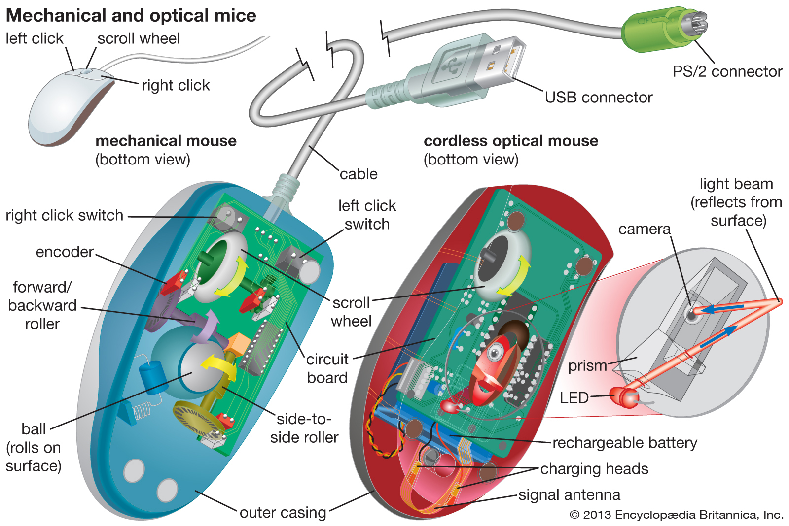

# Hardware tutorial handbook

## Table of contents:

- Input
    - Mouse
    - Keyboard
- Output
    - Plasma screen
    - Speakers
- Processors
    - CPU
    - GPU
- Storage
    - HDD
    - RAM
- Trends

## Input

### Mouse
- Diagram
    -  [1]
- Definition
    - How to use it:
        - move along surface, depress LMOUSE and RMOUSE, turn scrollwheel
    - What it does:
        - translates movement along a surface to movement of the cursor on a computer, and presses of LMOUSE and RMOUSE to left and right clicks, and movement of scrollwheel to scrolling. Sometimes includes other buttons for macros

### Keyboard
- Diagram
    - 
- Definition
    - How to use it:
        - Depress a key to send the labled letter or command to the computer connected to it.
    - What it does:
        - Each key is it's own key switch  that when depressed, sends a signal to the control chip inboard the keyboard, which then sends it to the computer it is connected to.

## Output

### Data Projector
- Diagram
    -  [3]
- Definition
    - How to use it:
        - To use a product like this, you must have:
            1. A computer or device to output video
            2. Some sort of cable to transport the video, there are different cables that allow for different quality.
        - To use it you:
            1. Plug the cable into both the Output device and the plasma screen
    - What it does:
        - One lamp projects light into Dichronic mirrors tha separate the light into colours, then these colours are reflected into LCD screens that change the brightness, then theese streams are combined using a prism

### Speaker
- Diagram
    -  [4]
    -  [5]
- Definition
    - How to use it:
        - To use a product like this you must have:
            1. A computer or device to output video
            2. A speaker
        - To use it you:
            1. Plug the Audio Cable attached to the speaker into the output device
    - What it does:
        - Wattage into the speaker goes through a copper cable surrounding a ring inside a magetised ring, and outside an oppositely magnetised pole. This causes the ring to move up and down, moving a diaphragm which moves the air in sound waves.

## Processors

### CPU (Central Processing Unit)
- Diagram
    -  [6]
- Definition
    - How to use it:
        - In the frame of reference of using a CPU without connecting it to a computer, you would need to send signals in through wiring, in the form of binary strings, and take an output in a similar form.
    - What it does:
        - 

### GPU (Graphics Processing Unit)
- Diagram
    -  [7]
- Definition
    - How to use it:
        - 
    - What it does:
        - 

## Storage

### HDD (Hard Disk Drive)
- Diagram
    -  [8]
- Definition
    - How to use it:
        - 
    - What it does:
        - 

### RAM (Random Access Memory)
- Diagram
    -  [9]
- Definition
    - How to use it:
        - 
    - What it does:
        - 

## Trends

## References

[1]: Encyclopedia Britannica. 2020. Computer Peripheral | Definition & Examples. [online] Available at: <https://www.britannica.com/technology/input-output-device> [Accessed 11 March 2020].

[2]: 

[3]: En.wikipedia.org. 2020. Plasma Display. [online] Available at: <https://en.wikipedia.org/wiki/Plasma_display# /media/File:Plasma-display-composition.svg> [Accessed 11 March 2020].

[4]: Centerpointaudio.com. 2020. How Speakers Work. [online] Available at: <http://www.centerpointaudio.com/howspeakerswork.aspx> [Accessed 11 March 2020].

[5]: Chick, C., 2020. Understanding TRRS And Audio Jacks - Cable Chick Blog. [online] Cablechick.com.au. Available at: <https://www.cablechick.com.au/blog/understanding-trrs-and-audio-jacks/> [Accessed 11 March 2020].

[6]:En.wikipedia.org. 2020. Computer Architecture. [online] Available at: <https://en.wikipedia.org/wiki/Computer_architecture> [Accessed 11 March 2020].

[7]:En.wikipedia.org. 2020. Graphics Processing Unit. [online] Available at: <https://en.wikipedia.org/wiki/Graphics_processing_unit> [Accessed 11 March 2020].

[8]: CCM. 2020. Hard Drive. [online] Available at: <https://ccm.net/contents/385-hard-drive> [Accessed 12 March 2020].

[9]: Yip, J., 2020. Memory RAM And Slot Diagram. [online] Johnsonyip.com. Available at: <http://johnsonyip.com/wordpress/2010/07/27/cleaning-troubleshooting-dirty-ram-electronic-gold-contacts-with-clean-clothe-and-rubbing-alcohol/memory-ram-and-slot-diagram/> [Accessed 14 March 2020].

Cite This For Me. 2020. Save Time And Improve Your Marks With Citethisforme, The No. 1 Citation Tool. [online] Available at: <https://www.citethisforme.com/> [Accessed 10 March 2020].